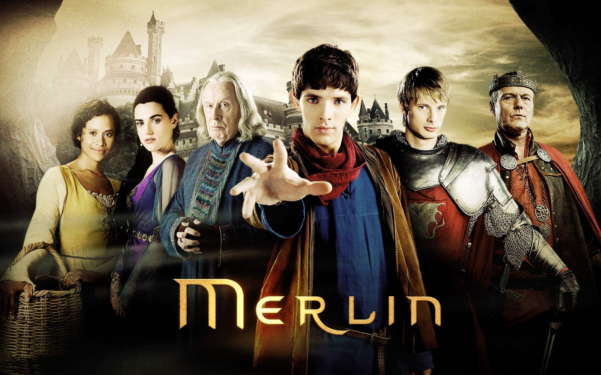

# Sema Nur Aktaş

### Hakkımda
Merhaba. Ben Sema Nur Aktaş! İstanbul'da yaşıyorum. Tarihi kitaplar okumayı ve bilimkurgu veya fantastik dizileri çok seviyorum. Web geliştirme ile ilgileniyorum. Kodluyoruz'un bu eğitim serisi sayesinde harika şeyler öğrendim ve öğrenmeye devam ediyorum! Siz de aramıza katılın!

#### İlgi Alanlarım
1. Kitap
   * Serenad
   * Uçurtma Avcısı
   * Aşk ve Gurur
2. Film
   * Alacakaranlık
   * Avatar
   * Ayla
3. Dizi
   * Merlin
   * Black Mirror
   * Arrow

## Sevdiğim Diziler
 
İngiliz yapımı bir dizi olan Merlin'de büyünün ve doğaüstü yaratıkların diyarı Camelot'ta ileride önemli bir büyücü olacak Merlin’in gençlik yıllarını konu almaktadır. Kral Uther tarafından yönetilen Camelot Krallığı’nda büyü yapmanın yasak olduğu bir dönemde, doğaüstü yeteneklere sahip Merlin adında genç bir adamın yolu ileride tahta geçecek Prens Arthur’la kesişir. İki genç adamın rekabetle başlayan tanışıklıkları kısa sürede dostluğa dönüşür.
